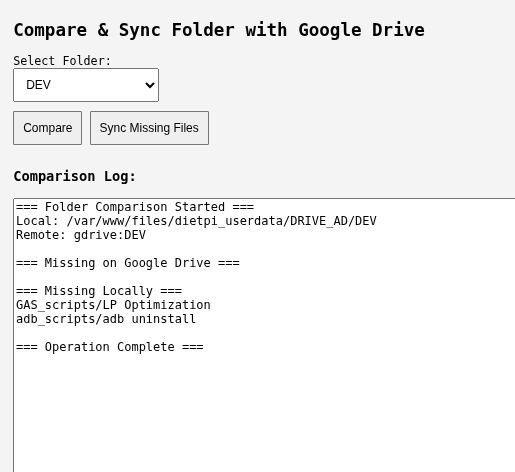

# PHP_drive_sync

A lightweight PHP + Bash system for comparing and syncing local folders with Google Drive using `rclone`. Designed for home servers running DietPi or Ubuntu
 
---

## 🖥️ Simple but powerfull Web Dashboard



The PHP dashboard (`compare.php`) lets you:

- Select a subfolder from your local backup folder of DRIVE
- Compare it with the matching Google Drive folder
- View missing files
- Trigger sync operations
- View logs 

---

## 📦 Installation

update the BASE folder of your Drive backup locally (eg. this is mine below):

BASE="/var/www/files/dietpi_userdata/DRIVE_AD"

---
## ⚙️ Rclone Setup (Google Drive)
Install rclone

```bash
curl https://rclone.org/install.sh | sudo bash
```
Configure Google Drive remote

```bash
rclone config
```
Choose n for new remote

Name it gdrive

Choose drive as the storage type

Follow the OAuth flow (browser or headless)

Accept default scopes unless you need team drive support

Test it

```bash
rclone lsf gdrive:
```
You should see your Drive folders listed.

Optional: Use custom config path

If you store your config at /etc/rclone.conf, use:

```bash
rclone --config=/etc/rclone.conf lsf gdrive:
```


## 🔧 Bash Script Usage

You can also use the script to comapre or sync directly without the PHP page:

```bash
# Compare only
sudo /usr/local/bin/compare_drive.sh compare FOLDER_NAME
```
# Compare and sync

🛠️ Requirements
rclone configured with Google Drive remote
